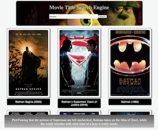

# React Cinema

Let's revisit our first project where we built a movie search engine using the Open Movie Database. This time we want to implement it using React. It should be a Single Page App, that is all the functionality should be on a single page, rather switch between multiple pages.

Before starting draw a plan of your application. What are some of the components you are going to need? Which components will fetch data and how will that data be displayed? Which components should be re-used? Rather than re-implementing your previous solution again have a think about what you have learned in the past week and how you can apply it here.

## The brief

We want to create a movie search engine. To power it we will use the [Open Movie Database](http://www.omdbapi.com). It provides access to a huge database of films via an **API**, which stands for **Application Programming Interface**. In short, it is a set of rules and procedures you need to follow to use a remote system.

To start using the OMDB API you will first need to sign up with them to receive and API key. The key issued to you will allow you 1000 requests per day and you will need to include this key as part of every request.


## React-cinema, movie title search engine powered by OMDB

- app where you can search movies by title and browse movie poster & plot description

## features

- type in movie title to fetch results from OMDB databse and display its posters, full movie title & year.

- Click on title name to display movie plot

- Click on movie poster to redirect to OMDB page for more details

##potential features and extension

- adpot CSS grid to ensure better responsiveness

- add favuorite to local storage for user to view later

- add sort function for ratings, years etc.

# Team

Ethan - ([Twitter](https://twitter.com/Ethanng329)) - ([Github](https://github.com/ethan329))

# instruction
```
npm run build 

```

